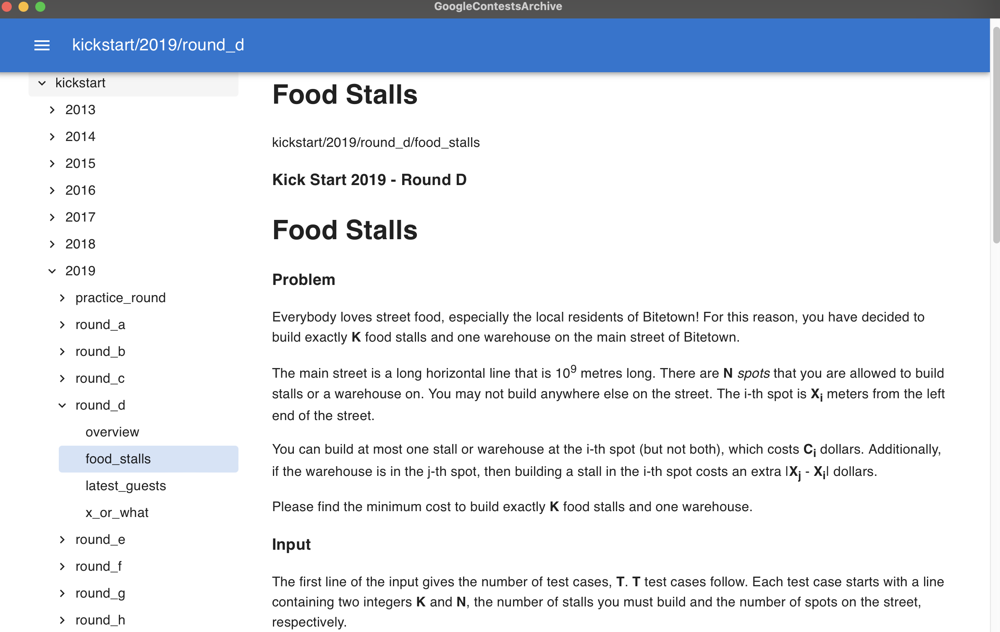

# Google Contents Archive Viewer

macOS desktop App by tauri+react

* archive repo: https://github.com/google/coding-competitions-archive
* to config downloaded archive directory: './src-tauri/src/config.rs'

```bash
yarn install

yarn tauri dev // for auto-reload dev

yarn tauri build // to release

```


